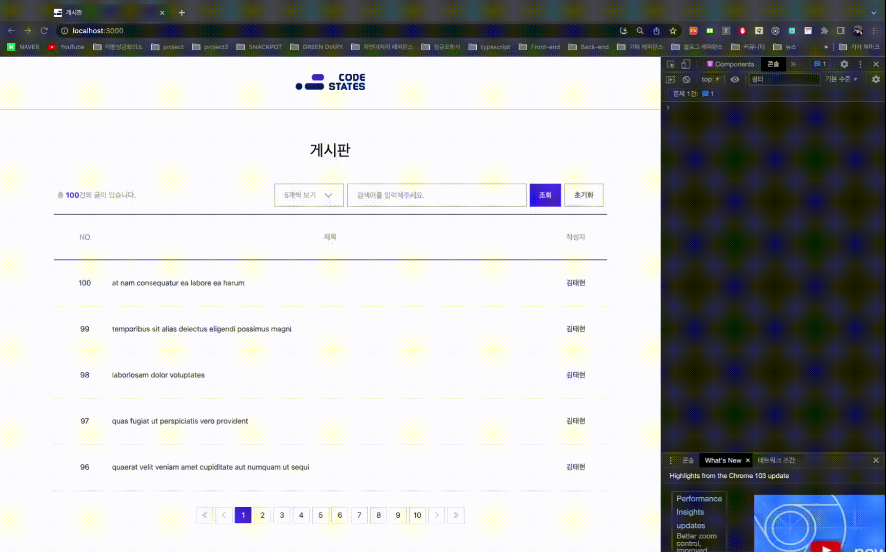

# codestates-fe-advanced-course (SEB*PART_06*김태현)

## 완성된 GIF 파일 및 배포 링크

## 프로젝트 실행 방법

1. `cd client` : 터미널에서 client 디렉토리로 접근 
2. `npm run start` : 로컬 환경에서 프로젝트 실행

## 사용한 스택 목록

- Typescript : v4.7.4
- React : v18.2.0
- Recoil : v0.7.4
- Tailwind CSS : v3.1.6
- axios : v0.27.2
- Figma

## 구현한 기능 목록

- 게시판 메인
  - 게시물 리스트
  - 페이지 사이즈 조절 드롭다운
  - 게시물 검색바
  - 하단 페이지 네비게이션 (이전 페이지, 다음 페이지, 페이지 번호 이동, 페이지 그룹 이동)
- 게시물 상세 페이지
  - 게시물 상세 정보
  - 댓글 리스트
  - 댓글 페이지네이션 (페이지 당 3개씩 렌더링)
- 공통
  - 모든 API 요청에 커스텀 훅 제작하여 사용
  - 레이아웃 컴포넌트
  - 헤더 컴포넌트
  - 로딩 컴포넌트
  - 에러 컴포넌트
  - 경고 모달

## 구현 방법 혹은 구현하면서 어려웠던 점

- 전체적인 구조

  - 크게는 게시판 메인으로 연결되는 `<Main />` 컴포넌트와 게시물 상세 페이지로 연결되는 `<Post />` 컴포넌트로 분리했습니다.  
  - `<App />`에 라우트를 정의하는 것이 직관적이지 않은 것 같아 `<Router />`라는 컴포넌트를 만들어, 그 곳에 두 개의 라우트를 정의했습니다.  
  - 연결되는 path는 각각 게시판 메인(`<Main />`)은 index path인 "/" 로, 게시물 상세 페이지(`<Post />`)는 "/post/:id" 로 path 파라미터를 통해   동적으로 라우팅시켰습니다.
  - 라우트가 연결된 위 두가지 컴포넌트 내에서는 비슷한 UI가 반복되거나 의미 맥락 상 구분이 필요한 단위를 구분하여   세분화된 컴포넌트들로 구성하였습니다.

- 레이아웃 및 디자인

  - 페이지마다 공통적으로 반복되는 레이아웃(헤더, 최대 너비 등)은 `<Layout />` 컴포넌트를 만들어 ReactNode 타입의 children prop을 받도록 구성했습니다.
  - CSS는 클래스 명을 구분하지 않아도 되고, 인라인 방식, 축약형으로 프로토타입을 빠르게 구현할 수 있는 tailwind CSS 라이브러리를 선택했습니다.

- 어려웠던 점
  - useEffect 훅을 쓸 때 dependency 룰을 완벽하게 지키는 것이 조금 어려운 부분이었습니다.

## 직접 작성한 Wireframe 혹은 Prototype

- UI 디자인

  - 기본적으로 Figma 툴을 사용하여 화면을 그렸습니다.
  - primary 컬러는 코드스테이츠 로고의 컬러를 차용했습니다.
  - 전체적인 UI 디자인은 엘포인트의 고객센터 공지사항 게시판을 레퍼런스했습니다. [레퍼런스 링크](https://www.lpoint.com/app/center/LHDA100100.do)

## 성능 최적화에 대해서 고민하고 개선한 방법

- Props Drilling에 대한 고민

  - 부모 컴포넌트에서 자식 컴포넌트로의 drilling을 통해 props를 전달하는 것이 무조건 나쁘다고 생각하진 않지만,   그럼에도 특정 컴포넌트에서는 넘겨받은 props를 사용하지 않고 단순히 전달만 하는 등 생산적이지 못하다고 생각했습니다.
  - 가급적 상태 관련 라이브러리를 쓰고 싶지 않았기 때문에, React에 빌트인으로 들어가 있는 Context API를 고민하게 되었습니다.
  - 물론 적용하면 Props Drilling을 피할수 있었지만, 이번엔 컴포넌트 렌더링 성능에 대한 문제가 떠올랐습니다.
  - 정의된 Context API 내에서 상태값이 어느 하나라도 변경되면 Provider로 감싸진 모든 자식 컴포넌트들이 Props의 변화가 없음에도 리렌더링 된다는 문제였습니다.
  - 물론 적절한 Provider와 함수를 활용하면 해결할 수도 있었겠지만, 해결하는 것의 비용이 전역상태 라이브러리를 설치해 사용하는 것의 비용보다 높다는 결론을 내렸습니다.
  - 따라서 전역상태 라이브러리인 Recoil을 도입했습니다.
  - 많은 전역상태 관리 라이브러리 중 Recoil을 도입한 이유는 몇가지가 있습니다.  우선 대표적으로 사용되는 Redux와 비교해서 boiler-plate 코드의 양이 훨씬 적어 설정하기 편했습니다.  물론 Redux 팀에서 만든 Redux-toolkit도 사용해봤으나 그와 비교해도 훨씬 단순했습니다.   또 기존에 쓰던 React hook과 같이 선언적인 API를 제공해줘서 실제로 코드를 작성하는 것도 익숙하고 편했습니다.
  - 결론적으로, Recoil을 도입해 몇가지 UI와 관련된 상태값 요소들을 전역으로 관리하여 불편하게 느껴졌던 UX를 해결했습니다. (게시판 목록에서 게시글 상세페이지로 접근했다가 다시 뒤로 가기를 눌렀을 시 유저가 머물던 페이지가 초기화 되는 현상 등)

- 컴포넌트 렌더링 최소화

  - 조금이라도 불필요한 컴포넌트 렌더링을 줄여보고 싶었습니다.
  - 간단하면서 강력한 `React.memo`를 활용해보기로 했습니다.
  - 적용은 게시판 메인 페이지 리스트에서 각각의 아이템인 `<PostItem />`에 적용했습니다.
  - `<PostItem />`은 각각 같은 props들을 전달받고 있고 가장 자주 렌더링되기 때문이었습니다.
  - 그리고 부모 컴포넌트인 `<PostList />`에서 post props를 넘겨받는데 각각의 post는 고유한 id로 관리되고 있어서 식별하기 쉬울 것이라 판단했습니다.
  - `React.memo`는 기존 props와 신규 props에 대해 기본적으로 얕은 비교를 제공했습니다.  post라는 props는 객체기 때문에 얕은 비교시 항상 다른 것이라 인지하므로 다른 비교군이 필요했습니다.
  - 다행히 `React.memo`에서는 두번째 인자로 함수를 전달할 수 있게되어 있었고, 해당 함수에서 원시 타입이면서 고유하게 관리되고 있는 `post` 객체의 `id`를 비교할 수 있었습니다.
  - 결과적으로 두 id를 비교하는 `areEqual`함수를 만들고 `export default React.memo(PostItem, areEqual)`의 형태로 export하니 미약하지만 렌더링을 줄일 수 있었습니다.
  - 잘 적용되었는지 확인을 위해 로컬 환경에서 콘솔창에 `<PostItem />` 컴포넌트(함수)의 실행횟수를 테스트 해봤습니다.
  - 상황은 `<PostItem />`을 드롭다운을 통해 한 페이지당 5개씩 보기에서 -> 10개씩 보기로 변경해본 상황입니다.

  1. `React.memo` 적용전 : `<PostItem />` 10번 그대로 재실행
     

  2. `React.memo` 적용후 : `<PostItem />` 추가되는 5개의 목록에 대해서만 재실행
     

## 추가 구현 사항에 대한 구현 방법과 설명

- 페이지네이션 개요

  - `<PageNavigation />`이라는 컴포넌트를 제작하여 게시판 이외의 어느 컴포넌트에서든 재사용할 수 있도록 제작했습니다.   (댓글 목록에서도 페이지네이션을 사용했습니다.)
  - `pageSize`, `numberOfPagesPerGroup`, `dataLength`, `currentPage`, `setCurrentPage` , `setModal`을 props로 받도록 했습니다. 각 prop의 명세는 아래와 같습니다.
  - `pageSize` : 한 페이지에 렌더링 될 아이템의 개수를 정합니다. (드롭다운으로 선택가능: 기본은 10개)
  - `numberOfPagesPerGroup` : 한 페이지당 보이는 페이지 번호 개수입니다. 본 과제에서는 10개를 사용했습니다.
  - `dataLength` : page개수를 정하게 될 data(배열)의 총 길이(length) 입니다.
  - `currentPage` : 현재 선택된 페이지 번호입니다.
  - `setCurrentPage` : 현재 선택된 페이지를 이동시킬 수 있는 상태 변경 함수입니다.
  - `setModal` : 더이상 페이지가 없을 경우 나타나는 모달에 대한 상태 변경 함수입니다.

- 페이지네이션 동작

  - `pageGroup` 변수를 사용해 `currentPage`에서 `numberOfPagesGroup`을 나누고 `Math.ceil`을 통해 올림한 값을 관리합니다.
  - `numberOfPages`의 길이를 가지는 배열을 만들어 `map`메소드를 사용해 각 인덱스마다 `pageGroup * numberOfPagesGroup`값과 비교하여  조건에 맞는 인덱스만 렌더링 시키는 방식으로 구현했습니다.
  - 양방향 페이지 이동 버튼으로 페이지 한 칸씩 이동이 가능합니다.

- 추가 사항
  - 양방향 페이지 그룹 이동 버튼으로 페이지의 그룹을 한칸씩 뛰어넘을 수 있습니다.   ex) 보고 있는 화면에 렌더링 된 페이지 번호가 [ 1 - "2" - 3 - 4 - 5 ] 이고 현재 머물고 있는 페이지가 2번 페이지일 때,  다음 페이지 그룹 이동 버튼을 눌렀을 시 [ "6" - 7 - 8 - 9 - 10 ] 으로 이동 현재 머물고 있는 페이지는 6번 페이지로 변경됩니다.
  - 마지막 페이지에서 다음 페이지 이동 버튼을 누를 경우 하단에 마지막 페이지라는 `<Modal />`이 나타납니다.
  - 상세페이지 라우트로 이동했다가 다시 뒤로 왔을 때 머물고 있던 페이지가 초기화되는 것은 UX상 너무 불편했기 때문에   전역상태로 현재 페이지 등의 값을 관리하여 유저가 글을 보고 다시 뒤로 와도 기존에 머물던 페이지를 유지하도록 처리했습니다.

## 기타 구현 사항

- API 요청 커스텀 훅

  - 필요한 요청의 base url이 모두 같았기 때문에, axios 인스턴스를 하나 생성하여 baseUrl 속성에 같은 url을 정의해 반복을 줄였습니다.
  - 필요한 데이터는 모두 GET 요청으로 불러와야 했고, 공통적으로 loading 상태와 error 상태가 필요했습니다.
  - 이 때문에, 위에서 만든 axios 인스턴스와 `useState`, `useEffect`를 활용하여, general하게 모든 GET 요청을 처리할 수 있는 `useFetch`라는 함수를 만들었습니다.
  - `useFetch`는 url과 get요청에 사용되는 params 두 가지를 파라미터로 받아 `{data, loading, error}` 형태의 객체를 리턴하도록 만들었습니다.
  - `useFetch` 내에서 상태로 관리되는 data는 필요한 GET 요청마다 형태가 달랐기 때문에 제네릭 타입을 활용하여 이를 해결했습니다.
  - `useFetch` 함수를 활용하여 전체 게시물 리스트, 특정 게시물 정보, 댓글 리스트를 불러오는 api 요청을 각각  
    `usePostList` `usePost` `useCommentList`의 커스텀 훅으로 제작했습니다.
  - UI와 관련된 로직과 API 요청 로직을 분리하고 조금 더 직관적으로 이해할 수 있도록 
    위에서 제작한 커스텀 훅들은 컴포넌트 내에 정의하지 않고 외부에 정의하여 필요에 따라서 import 시켜와 사용했습니다.

- `<SearchBar />`

  - 유저가 게시판 목록에서 제목으로 글을 검색할 수 있도록 검색 가능한 컴포넌트를 제작했습니다.
  - 유저가 인풋에 입력한 값과 원본 데이터의 `title`을 비교하여 조회 버튼을 누르면 원본 데이터에서 filter 메소드를 통해 해당되는 글 목록만 렌더링되도록 구현했습니다.
  - 최초에 불러온 원본 데이터 목록과 별개로 위 과정을 통해 필터된 목록은 전역 상태로 관리합니다.
  - 두 글자 이하로 입력후 검색할 시 검색창 위에 간단한 애니메이션이 구현된 경고 메세지가 나타납니다. ("검색어는 두자 이상 입력해 주세요.(공백 불가)")

- `<Dropdown />`

  - 한 페이지 당 보이는 글의 개수를 유저가 직접 선택할 수 있도록 드롭다운 셀렉트 컴포넌트를 제작했습니다.
  - 기본값은 10개씩 보기 이며 5개씩 보기 선택이 가능합니다.
  - transLate와 opacity 속성을 통해 간단한 애니메이션을 구현했습니다.
  - 유저의 편의를 위해 해당 드롭다운에서 선택된 값(페이지 사이즈)도 전역으로 관리합니다.

- `<Loading />`

  - 위에서 제작한 API 요청 커스텀 훅의 결과로 리턴되는 값 중 `isLoading`속성을 통하여   데이터 요청이 진행중일 경우(`isLoding = true`) 로딩 컴포넌트를 나타나게 했습니다.
  - css의 `border-radius: 100%`를 활용해 `div`를 원으로 만들고 해당 `div`의 `border-top-color: transparent`를 통해 빈 구간을 만든 뒤   `transform: rotate` 속성과 `animation: infinite` 을 통해 로더가 빙글 빙글 돌아가도록 처리했습니다.

- `<NoContents />`

  - 요청된 결과 혹은 검색을 통해 필터된 결과(게시물 리스트, 댓글 리스트)가 없을 때 나타나는 리스트 대신 렌더링 될 컴포넌트입니다.
  - 해당되는 조건의 글이 없을 시 유저의 직관적인 이해를 돕기 위해 제작했습니다.

- `<Header />`

  - 모든 페이지에 상단에 공통으로 들어가는 컴포넌트입니다.
  - 해당 컴포넌트에 있는 로고를 누를 시 모든 전역 상태 값을 초기화하고 index 페이지로 이동하도록 제작했습니다.

- `<Error />`

  - 위에서 제작한 API 요청 커스텀 훅을 통해 요청 후, 실패할 시 나타나는 컴포넌트를 제작했습니다.
